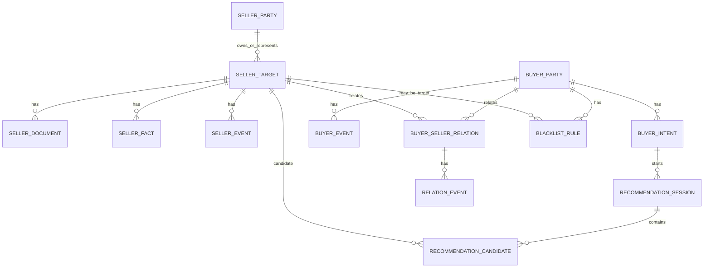

# Match-MA 领域模型与用户场景草案 v0.1

日期：2026-05-25
状态：讨论草案
范围：产品定位、核心对象、数据边界、用户场景、一期/二期范围；暂不确定具体 RAG / Agentic RAG / 检索技术路线。

---

## 1. 背景与定位

新系统定位为：

> 面向内部咨询公司 / 中间方团队的并购标的与买家需求撮合管理平台。

系统主要服务内部用户，不面向卖家或买家开放。后续如需给买家展示，可以另做资源看板，展示标的库行业、地区、成交量、意向量等统计数据，但不开放底层明细数据。

新系统不再以旧系统中的 `report / chunk / FastGPT knowledge base` 为中心，而是围绕以下业务核心构建：

- 卖家标的库：沉淀标的项目、卖方主体、标的事实、交易状态、附件证据、跟进事件。
- 买家需求库：沉淀买方主体、收购意向、收购进度、历史反馈、黑名单。
- 撮合推荐工作台：基于某次买家意向或匿名搜索任务，从标的库中生成候选池，并由 LLM 输出最终推荐 list、推荐理由、风险说明和推进建议。

新系统与 FastGPT 无关，不复用 FastGPT 推送、FastGPT 知识库、FastGPT Agent 或相关兼容逻辑。

---

## 2. 基本设计原则

1. 新系统自行生成 ID，不沿用旧系统 BD 编号。
2. `seller_target` 是标的项目，不等同于公司；约 90% 是公司本身，约 10% 是某公司的部分资产、业务线或股权包。
3. `seller_party` 是卖方 / 公司主体；多数情况下 `seller_target` 和 `seller_party` 名称相同，但两者必须分开建模。
4. 买家按公司主体管理，草案中命名为 `buyer_party`。用户前述第 3 点中“买家也建 seller_party”疑似笔误，本草案按 `buyer_party` 处理。
5. 买家意向可以绑定具体买家，也可以是不绑定买家的匿名需求 / 临时搜索任务。
6. 标的字段体系应围绕买家意向构建：买家意向中高频出现的字段，在标的中应尽量有对应字段。
7. LLM 负责最终推荐 list、综合分析、推荐理由、风险说明和推进建议；但 LLM 应基于候选池和证据包工作，而不是直接在全库上自由发挥。
8. 技术路线暂不预设 RAG。是否使用 RAG、Advanced RAG、Agentic RAG、LLM 生成 SQL、向量检索、rerank 等，待需求模型稳定后再调研和测试。
9. 推荐结果长期留痕，用于回看聊天记录、复盘推荐过程、更新买家库和沉淀反馈。
10. 旧系统数据暂不迁移；旧系统可作为参考，不作为新系统依赖。

---

## 3. 核心业务对象总览



核心对象：

| 对象 | 说明 | 一期重要性 |
| --- | --- | --- |
| `seller_party` | 卖方 / 公司主体 | 高 |
| `seller_target` | 标的项目，支持公司、资产、业务线等类型 | 高 |
| `seller_fact` | 标的事实字段及证据 | 高 |
| `seller_document` | 附件、解析文本、证据定位 | 高 |
| `seller_event` | 标的跟进事件 | 高 |
| `buyer_party` | 买方公司主体 | 高 |
| `buyer_intent` | 买方收购意向，可绑定买家或匿名 | 高 |
| `buyer_seller_relation` | 买方与标的之间的接触 / 推进状态 | 高 |
| `relation_event` | 买方与某标的关系的事件流水 | 高 |
| `recommendation_session` | 一次推荐对话 / 推荐任务 | 高 |
| `recommendation_candidate` | 推荐候选、分数、证据、过滤说明 | 高 |
| `blacklist_rule` | 黑名单 / 硬排除规则 | 高 |
| `operational_task` | 催办营销人员的待办任务 | 二期 |
| `dashboard_snapshot` | 看板统计快照 | 二期 |

---

## 4. ID 与命名设计

不使用旧系统 BD 编号作为核心字段。

建议 ID：

| 对象 | ID 示例 | 说明 |
| --- | --- | --- |
| `seller_party` | `sp_20260525_xxxxxx` | 卖方主体 ID |
| `seller_target` | `st_20260525_xxxxxx` | 标的项目 ID |
| `buyer_party` | `bp_20260525_xxxxxx` | 买方主体 ID |
| `buyer_intent` | `bi_20260525_xxxxxx` | 买方意向 ID |
| `recommendation_session` | `rs_20260525_xxxxxx` | 推荐会话 ID |
| `buyer_seller_relation` | `bsr_20260525_xxxxxx` | 买卖双方关系 ID |
| `seller_document` | `doc_20260525_xxxxxx` | 附件 / 资料 ID |
| `event` | `evt_20260525_xxxxxx` | 事件 ID |

可以额外设置便于人工识别的展示字段：

- `display_name`：标的展示名，如“上海启元项目”。
- `short_name`：简称。
- `internal_code`：可选内部编号，仅展示和搜索，不作为业务主键。

---

## 5. 用户与角色

系统当前仅面向内部用户。

建议角色：

| 角色 | 说明 |
| --- | --- |
| `marketing_user` | 营销人员 / 中间方，负责维护买家、卖家、跟进记录 |
| `marketing_manager` | 营销管理，可查看团队数据、分配负责人、查看统计 |
| `admin` | 系统管理员，负责用户、配置、字典、全局权限 |
| `readonly_user` | 可选，只读查看 |

权限粒度：

- 不做字段级权限。
- 权限最多到标的级别 / 买家级别。
- 仍建议保留操作审计，记录谁创建、修改、推荐、标记不感兴趣、合并标的等操作。

负责人关系：

- 标的通常由特定营销人员维护。
- 买家通常由特定营销人员维护。
- 一个买家的一个收购意向可以看作一个业务任务，但“催办待办任务”作为独立功能放二期。

---

## 6. 卖家侧数据模型

### 6.1 seller_party

卖方 / 公司主体。

建议字段：

| 字段 | 说明 |
| --- | --- |
| `seller_party_id` | 主键 |
| `name` | 公司 / 卖方主体名称 |
| `aliases` | 别名、简称 |
| `unified_credit_code` | 统一社会信用代码，可为空 |
| `listed_status` | 上市 / 非上市 / 新三板 / 港股 / 其他 |
| `stock_code` | 股票代码 |
| `registered_region` | 注册地 |
| `headquarter_region` | 总部所在地 |
| `website` | 官网 |
| `owner_user_id` | 负责人 |
| `created_at` / `updated_at` | 时间戳 |

### 6.2 seller_target

标的项目。

`target_type` 建议支持：

- `company`：公司整体。
- `equity`：股权包 / 控制权。
- `asset`：资产包。
- `business_line`：业务线 / 板块。
- `listed_control`：上市公司控制权 / 壳资源。
- `other`：其他。

建议字段：

| 字段 | 说明 |
| --- | --- |
| `seller_target_id` | 主键 |
| `seller_party_id` | 关联卖方主体 |
| `target_type` | 标的类型 |
| `display_name` | 标的展示名 |
| `short_name` | 简称 |
| `description` | 一句话描述 |
| `recommendation_status` | `recommendable` / `on_hold` |
| `target_lifecycle_status` | 可选：活跃、已成交、归档等，后续再定 |
| `owner_user_id` | 负责人 |
| `created_at` / `updated_at` | 时间戳 |

一期推荐可用状态保持简单：

- `recommendable`：可推荐。
- `on_hold`：暂不推荐。

“已成交”“下架”等可先作为事件或生命周期状态，后续再决定是否纳入一期。

### 6.3 seller_fact / seller_profile

卖家标的事实应围绕买家意向字段构建。

可以有两层：

1. `seller_profile`：当前可直接用于筛选和推荐的结构化快照。
2. `seller_fact`：每条事实的来源、证据、置信度和历史记录。

一期可以先实现 `seller_profile` + 简化 `seller_fact`，避免过度复杂。

#### 6.3.1 推荐高频字段

| 维度 | seller_profile 字段 | 说明 |
| --- | --- | --- |
| 基础 | `target_type` | 公司 / 资产 / 业务线等 |
| 基础 | `listed_status` | 上市状态 |
| 行业 | `industry_level1` | 一级行业 |
| 行业 | `industry_level2` | 二级行业 |
| 行业 | `sub_sectors` | 细分赛道，如 IVD、CXO、储能 |
| 行业 | `products_services` | 产品 / 服务 |
| 地域 | `registered_region` | 注册地 |
| 地域 | `headquarter_region` | 总部所在地 |
| 地域 | `operation_regions` | 经营地 |
| 地域 | `production_regions` | 产能所在地 |
| 地域 | `relocation_possible` | 是否可迁址 / 落地 |
| 财务 | `revenue_yuan` | 营收 |
| 财务 | `net_profit_yuan` | 净利润 |
| 财务 | `profit_total_yuan` | 利润总额 |
| 财务 | `asset_total_yuan` | 资产总额 |
| 财务 | `debt_ratio` | 资产负债率 |
| 财务 | `financial_year` | 财务年份 |
| 财务 | `financial_period_type` | 年度 / 半年度 / TTM / 预测等 |
| 财务 | `financial_source_quality` | 年报 / 审计 / 管理层口径 / 估算 |
| 交易 | `valuation_yuan` | 估值 |
| 交易 | `offer_yuan` | 报价 |
| 交易 | `pe_ratio` | PE，优先取用户/材料明确输入，其次计算 |
| 交易 | `transfer_ratio` | 拟转让比例 |
| 交易 | `control_possible` | 是否可能控股 |
| 交易 | `consolidation_possible` | 是否可能并表 |
| 交易 | `deal_path` | 股权转让、增资、资产收购等 |
| 交易 | `selling_willingness` | 出售意愿 |
| 交易 | `is_still_for_sale` | 是否还卖 |
| 风险 | `risk_tags` | 诉讼、环保、ST、退市风险、非标审计等 |
| 协同 | `customer_resources` | 客户资源 |
| 协同 | `certifications` | 资质 |
| 协同 | `technology_barriers` | 技术壁垒 |
| 协同 | `export_capability` | 出口能力 |
| 协同 | `team_stability` | 团队稳定性 |
| 检索 | `normalized_tags` | 规范标签 |
| 检索 | `free_tags` | 自由标签 |
| 完整度 | `missing_fields` | 推荐关键字段缺失情况 |
| 完整度 | `last_verified_at` | 最近核验时间 |

### 6.4 数据来源

卖家基础数据有三类来源：

1. 文件类提取总结：企业年报、财报、审计报告、BP、介绍材料等。
2. 跟进记录：中间方 / 营销人员提交的推进记录、会议纪要、聊天记录。
3. 公开网络搜索：官网、公告、新闻、工商、监管、诉讼、处罚等。

建议事实来源类型：

| source_type | 说明 |
| --- | --- |
| `uploaded_document` | 上传附件 |
| `followup_record` | 跟进记录 |
| `public_research` | 公开网络检索 |
| `manual_edit` | 人工编辑 |
| `calculated` | 系统计算，例如 PE |
| `llm_inferred` | LLM 推断，默认低置信度，不宜直接作为硬事实 |

事实优先级建议：

```text
人工确认 > 最新跟进记录 > 官方公告 / 年报 / 审计报告 > 上传介绍材料 > 公开网页搜索 > LLM 推断
```

不同字段优先级可不同：

- 财务数据：官方年报 / 审计报告优先。
- 是否还卖、报价、卖方意愿：最新跟进记录优先。
- PE：明确输入优先，其次材料披露，其次由估值和利润计算。

### 6.5 附件级证据定位

需要保留附件级证据定位。

一期建议至少保留：

| 字段 | 说明 |
| --- | --- |
| `document_id` | 附件 ID |
| `filename` | 文件名 |
| `file_type` | PDF / Word / Excel / PPT / image 等 |
| `parsed_text_path` | 解析文本路径 |
| `page_number` | 页码，可为空 |
| `sheet_name` | Excel sheet，可为空 |
| `quote_snippet` | 支撑字段的原文片段 |
| `extracted_at` | 提取时间 |
| `extractor` | parser / LLM / manual |

---

## 7. 买家侧数据模型

### 7.1 buyer_party

买方主体，按公司管理，不必过度区分集团、平台、基金、二级公司等。

建议字段：

| 字段 | 说明 |
| --- | --- |
| `buyer_party_id` | 主键 |
| `name` | 买方公司名称 |
| `aliases` | 简称 / 别名 |
| `buyer_type` | 产业集团、上市公司、国资平台、基金、政府招商主体等，可选 |
| `industry_background` | 产业背景 |
| `regions` | 所在区域 / 重点区域 |
| `funding_capacity` | 资金能力，可为空 |
| `has_listed_platform` | 是否有上市平台 |
| `current_acquisition_status` | 当前是否仍考虑收购，可为空 |
| `owner_user_id` | 负责人 |
| `created_at` / `updated_at` | 时间戳 |

### 7.2 buyer_intent

买家收购意向。可以绑定 `buyer_party`，也可以匿名存在。

本系统中，“某买家的一个收购意向”可视为一个业务任务，但不等同于二期待办任务。

建议字段：

| 字段 | 说明 |
| --- | --- |
| `buyer_intent_id` | 主键 |
| `buyer_party_id` | 可为空，允许匿名需求 |
| `intent_name` | 意向名称，如“浙江医药健康并表收购需求” |
| `raw_input` | 用户原始输入 |
| `parsed_summary` | LLM 解析摘要 |
| `status` | active / paused / closed，可后续决定 |
| `owner_user_id` | 负责人 |
| `created_at` / `updated_at` | 时间戳 |

### 7.3 买家意向字段

买家意向字段应与标的字段一一对应，至少覆盖高频字段：

| 维度 | buyer_intent 字段 | 说明 |
| --- | --- | --- |
| 行业 | `industry_requirements` | 一级行业、二级行业、细分赛道 |
| 地域 | `region_constraints` | 硬地域条件，如长三角 |
| 地域 | `region_preferences` | 偏好地域，如浙江优先 |
| 标的类型 | `target_type_requirements` | 公司、资产、上市/非上市等 |
| 上市状态 | `listed_status_preference` | 上市 / 非上市 / 均可 |
| 财务 | `revenue_min_yuan` | 营收要求 |
| 财务 | `net_profit_min_yuan` | 净利润要求 |
| 财务 | `profit_total_min_yuan` | 利润总额要求 |
| 财务 | `asset_total_min_yuan` | 资产规模要求 |
| 财务 | `debt_ratio_max` | 负债率上限 |
| 估值 | `valuation_max_yuan` | 估值上限 |
| 估值 | `pe_max` | PE 上限 |
| 交易 | `control_required` | 是否要求控股 |
| 交易 | `consolidation_required` | 是否要求并表 |
| 交易 | `deal_path_preferences` | 股转、增资、资产收购等 |
| 交易 | `relocation_required_or_preferred` | 是否要求 / 偏好迁址落地 |
| 风险 | `negative_risk_tags` | 排除风险，如 ST、环保、重大诉讼 |
| 偏好 | `positive_preferences` | 技术壁垒、客户资源、出口能力等 |
| 排除 | `negative_preferences` | 明确不看行业、地区、类型等 |
| 资金 | `budget_yuan` | 资金规模 |
| 紧迫性 | `urgency` | 高 / 中 / 低，可选 |

### 7.4 hard / preference / unknown 策略

买家意向解析时，需要把条件拆成：

- `hard_constraints`：硬条件。
- `strong_preferences`：强偏好。
- `weak_preferences`：弱偏好。
- `negative_constraints`：负面硬排除。
- `missing_value_policy`：字段缺失时如何处理。

示例：

```json
{
  "hard_constraints": [
    "region in 长三角",
    "listed_status = 非上市",
    "net_profit_yuan >= 20000000 if known"
  ],
  "strong_preferences": [
    "province = 浙江",
    "pe_ratio <= 13"
  ],
  "negative_constraints": [
    "buyer_seller_relation.status = 买家不感兴趣"
  ],
  "missing_value_policy": {
    "net_profit_yuan": "keep_but_downgrade",
    "pe_ratio": "keep_but_flag_gap"
  }
}
```

原则：

```text
明确符合 > 未知但可能符合 > 明确不符合
```

- 明确不满足硬条件：排除。
- 明确满足：优先推荐。
- 字段未知：不直接排除，降权并标记为信息缺口。
- 买家明确不感兴趣：硬排除。

---

## 8. 买家-标的关系模型

### 8.1 buyer_seller_relation

该对象记录某买家和某标的之间的状态，是推荐系统的重要输入。

建议状态枚举先采用：

| 状态 | 说明 | 对推荐影响 |
| --- | --- | --- |
| `not_contacted` | 未接触 | 可推荐 |
| `recommended` | 已推荐 | 提示已推荐，可视情况重复推荐 |
| `not_interested` | 买家不感兴趣 | 对该买家硬排除 |
| `initial_contact` | 初步沟通 | 提示已有接触 |
| `materials_sent` | 资料已发送 | 提示已有接触 |
| `meeting` | 约谈中 | 提示已有接触 |
| `due_diligence` | 尽调中 | 提示进行中 |
| `bidding_or_offer` | 报价中 | 提示进行中 |
| `agreement` | 协议中 | 提示进行中 |
| `acquired` | 已收购 | 通常排除或提示已成交 |
| `terminated` | 终止 | 可根据终止原因决定是否排除 |
| `paused` | 暂缓 | 提示暂缓 |

规则：

- 某标的已与 A 买家在谈，不影响推荐给 B 买家。
- 推荐给 B 时，需要提示“已有 A、C 等买家接触 / 在谈”。
- 如果某买家对某标的标记为“不感兴趣”，后续对该买家硬排除。
- 后续如出现独家期 / 排他协议，可新增字段 `exclusive_until` 或 `is_exclusive`，再决定是否全局排除。

### 8.2 relation_event

记录买方与某标的关系的事件流水。

字段：

| 字段 | 说明 |
| --- | --- |
| `relation_event_id` | 主键 |
| `buyer_seller_relation_id` | 关联关系 |
| `event_date` | 事件日期 |
| `event_type` | 推荐、反馈、沟通、尽调、报价、终止等 |
| `content` | 事件内容 |
| `source_type` | 手工输入、聊天截图、会议纪要等 |
| `source_document_id` | 可选 |
| `created_by` | 创建人 |

---

## 9. 跟进记录分类

跟进记录不能整体写入一个 tracking 文本，而应进行分类。

默认流程：用户先选择标的 / 买家 / 关系对象，再输入跟进记录。AI 自动识别多项目、多买家的拆分能力作为备选功能，不作为默认路径。

一段跟进记录可能拆成：

| 类型 | 说明 | 入库位置 |
| --- | --- | --- |
| 标的事实更新 | 估值、报价、是否还卖、交易路径变化 | `seller_fact` / `seller_profile` |
| 标的事件 | 与项目方见面、补材料、协议推进 | `seller_event` |
| 买家-标的关系事件 | 某买家仍在联系、计划进场、不感兴趣 | `buyer_seller_relation` / `relation_event` |
| 买家事件 | 买家收购策略变化、暂停收购 | `buyer_event` |
| 内部策略 | 同步寻找其他买方、避免单一依赖 | `internal_note`，不进通用事实 |
| 待办任务 | 下周催协议、确认进场时间 | 二期 `operational_task` |

示例：

```text
上海启元项目
- 周二下午已与项目方见面沟通。
- 预计明天小毕团队能拿到4月份的时间表。
- 同步寻找其他买方，避免单一依赖。
- 无锡某上市公司仍在联系中，计划近期进场。
- 下周继续催促协议签署，并确认具体进场时间。
```

拆分结果：

- `seller_event`：已与项目方见面沟通。
- `seller_fact_candidate`：协议尚未签署、进场时间待确认、4 月份时间表待取得。
- `buyer_seller_relation`：无锡某上市公司与上海启元项目仍在联系中，计划近期进场。
- `internal_note`：同步寻找其他买方，避免单一依赖。
- `operational_task`：下周催协议、确认进场时间，放二期。

---

## 10. 黑名单模型

需要支持黑名单。

建议黑名单类型：

| 类型 | 说明 | 推荐影响 |
| --- | --- | --- |
| `buyer_target_blacklist` | 某买家不看某标的 | 对该买家硬排除 |
| `buyer_industry_blacklist` | 某买家不看某行业 | 硬排除或强降权 |
| `buyer_region_blacklist` | 某买家不看某区域 | 硬排除或强降权 |
| `buyer_risk_blacklist` | 某买家不接受某风险 | 硬排除或强降权 |
| `target_global_blacklist` | 某标的全局暂不推荐 | 全局排除或提示 |

“买家不感兴趣”默认生成或更新 `buyer_target_blacklist`。

---

## 11. 字典、标签与 SQL 筛选策略

用户提出的问题非常关键：是否所有标签都要配置字典，入库时按字典规范化，才能确保 SQL 查询可行？

本草案建议采用“受控字典 + 自由标签”的混合方案。

### 11.1 必须字典化的字段

这些字段会用于 SQL 硬过滤、统计和稳定排序，应尽量字典化：

- 行业一级分类。
- 行业二级分类。
- 地区：省、市、区域圈层，如长三角、珠三角。
- 上市状态。
- 标的类型 `target_type`。
- 推荐可用状态。
- 买家-标的关系状态。
- 交易路径。
- 是否控股 / 是否并表 / 是否迁址。
- 风险标签。
- 财务口径枚举。

### 11.2 可自由标签化的字段

这些字段可以先自由录入，再逐步治理：

- 细分赛道别名，如 IVD、CXO、光伏设备、反无人机等。
- 产品关键词。
- 客户资源关键词。
- 技术壁垒描述。
- 协同场景。

### 11.3 SQL 与 LLM 的分工

建议原则：

- SQL / 结构化查询用于缩小候选池和处理明确条件。
- LLM 用于复杂条件综合判断、未知字段处理、推荐理由、风险提示和最终 list。
- 不强求所有条件都可 SQL 化。
- 不允许 LLM 绕过明确黑名单和明确硬排除。

可能流程：

```text
买家意向解析
→ 字典规范化
→ SQL 处理明确硬条件和黑名单
→ 保留未知但可能符合的候选
→ 构造候选证据包
→ LLM 综合筛选和排序
→ 输出最终 list、理由、风险、推进建议
```

具体是否让 LLM 生成 SQL、是否使用向量检索 / RAG / rerank，后续单独做技术调研和测试。

---

## 12. 推荐会话模型

### 12.1 recommendation_session

推荐入口是对话窗口，且需要支持连续对话。

一次推荐会话应保存：

| 字段 | 说明 |
| --- | --- |
| `recommendation_session_id` | 主键 |
| `buyer_party_id` | 可为空 |
| `buyer_intent_id` | 可为空，匿名需求可后续转正式意向 |
| `raw_user_messages` | 用户对话输入 |
| `parsed_intent_snapshot` | 当前解析后的意向快照 |
| `candidate_generation_trace` | 候选池生成过程，技术方案待定 |
| `llm_prompt_version` | 推荐 prompt 版本 |
| `llm_output` | LLM 原始输出 |
| `final_recommendation_list` | 最终推荐 list |
| `created_by` | 创建人 |
| `created_at` / `updated_at` | 时间戳 |

连续对话示例：

1. 用户：找浙江医药标的。
2. 系统：解析条件，推荐一批。
3. 用户：利润低于 3000 万的去掉，只看可控股的。
4. 系统：更新当前 session 的 `parsed_intent_snapshot`，重新生成候选池和推荐 list。

### 12.2 recommendation_candidate

候选标的记录。

字段：

| 字段 | 说明 |
| --- | --- |
| `recommendation_candidate_id` | 主键 |
| `recommendation_session_id` | 推荐会话 |
| `seller_target_id` | 候选标的 |
| `candidate_source` | SQL、标签、全文、向量、人工加入等，技术待定 |
| `structured_match_summary` | 结构化匹配摘要 |
| `known_matched_fields` | 明确匹配字段 |
| `unknown_fields` | 关键缺失字段 |
| `known_failed_fields` | 明确不满足字段 |
| `existing_buyer_contacts` | 已有哪些买家接触 / 在谈 |
| `blacklist_hit` | 是否命中黑名单 |
| `llm_rank` | LLM 排名 |
| `llm_reason` | LLM 推荐理由 |
| `llm_risk_notes` | 风险提示 |
| `llm_next_steps` | 推进建议 |
| `user_decision` | 用户保留、剔除、加入 shortlist 等 |

### 12.3 LLM 推荐职责边界

LLM 必须输出最终推荐 list。

LLM 负责：

- 综合买家意向和候选标的证据。
- 在字段不完整时进行合理权衡。
- 解释为什么推荐。
- 解释为什么有风险或信息缺口。
- 给出推进建议。
- 在连续对话中根据用户补充条件调整推荐。

LLM 不应：

- 忽略买家明确“不感兴趣”的硬排除。
- 忽略黑名单。
- 编造标的不存在的财务、估值、交易状态。
- 把未知字段说成满足。
- 直接修改标的事实主数据，除非用户确认。

---

## 13. 推荐输出形态

前端可以采用对话窗口，但推荐结果应同时结构化保存和展示。

推荐回答建议包含：

1. 系统理解的买家意向。
2. 本次采用的硬条件、偏好、未知字段处理原则。
3. 最终推荐 list。
4. 每个标的的推荐理由。
5. 每个标的的风险和信息缺口。
6. 已有买家接触提示。
7. 推进建议。
8. 可点击查看证据。

示例结构：

```text
我理解本次需求如下：
- 行业：医药健康相关。
- 区域：长三角为硬条件，浙江为优先偏好。
- 标的类型：非上市公司。
- 利润：优先推荐 2000 万以上；利润未知保留但降权；明确低于 2000 万排除。
- 估值：PE 原则上不超过 13 倍，未知 PE 标记为信息缺口。
- 交易：需要并表。

推荐标的：
1. A 标的
   - 匹配理由：...
   - 风险 / 缺口：...
   - 已接触买家：...
   - 推进建议：...
```

---

## 14. 标的去重与合并

需要在新建标的项目时做去重校验。

可能匹配因子：

- 公司全称。
- 公司简称 / 别名。
- 统一社会信用代码。
- 股票代码。
- 官网。
- 注册地 + 行业 + 名称相似度。
- 已有 seller_party / seller_target。

流程：

```text
用户新建标的 / 上传资料
→ 系统识别公司和项目名称
→ 查询疑似重复标的
→ 展示相似结果和相似原因
→ 用户选择：合并 / 去重更新 / 仍然新建
```

操作：

- `merge`：合并到已有标的，保留新材料和新事实候选。
- `dedupe_update`：认为是同一标的，更新已有记录。
- `create_new`：确认不是重复，新建标的。

合并操作应进入审计日志。

---

## 15. 一期核心用户场景

### 场景 1：新建标的项目

用户上传企业年报、财报、BP、介绍材料，或输入基础文字。

流程：

1. 用户新建标的。
2. 系统解析附件。
3. 系统识别 seller_party、seller_target、target_type。
4. 系统做重复标的校验。
5. 用户选择新建 / 合并 / 更新已有。
6. 系统抽取 seller_profile 字段和 seller_fact 证据。
7. 系统可进行公开网络搜索补全。
8. 用户确认关键字段。
9. 标的进入可推荐或暂不推荐状态。

### 场景 2：更新标的基础事实

例如估值变化、是否还卖、报价变化、利润更新。

流程：

1. 用户选择标的。
2. 输入更新记录或上传新材料。
3. 系统识别事实字段变化。
4. 系统展示旧值、新值、来源、证据。
5. 用户确认是否覆盖当前 seller_profile。
6. 系统保留历史 seller_fact。

### 场景 3：录入标的跟进事件

例如见面、资料发送、项目方沟通。

流程：

1. 用户默认先选择标的。
2. 输入跟进记录。
3. 系统识别 seller_event、seller_fact_candidate、relation_event、internal_note。
4. 用户确认分类。
5. 系统保存事件。

### 场景 4：新建买家和买家意向

用户可以创建买家，也可以直接输入匿名需求。

流程：

1. 用户创建 buyer_party 或选择匿名需求。
2. 输入买家收购意向。
3. 系统解析行业、地域、财务、估值、交易、排除项、偏好。
4. 系统生成 buyer_intent。
5. 用户确认或修改解析结果。

### 场景 5：发起对话式推荐

流程：

1. 用户输入买家意向或选择已有 buyer_intent。
2. 系统解析本次搜索任务。
3. 系统根据黑名单、硬条件和候选生成策略缩小候选池。
4. 系统构造候选证据包。
5. LLM 输出最终推荐 list、推荐理由、风险、信息缺口和推进建议。
6. 用户继续追问或调整条件。
7. 系统保存推荐聊天记录和结构化结果。

### 场景 6：记录买家反馈

例如买家不感兴趣、继续沟通、进入尽调。

流程：

1. 用户在推荐结果或买家详情中选择某标的。
2. 标记反馈状态。
3. 系统更新 buyer_seller_relation。
4. 如为“不感兴趣”，系统写入 buyer_target_blacklist。
5. 后续该买家推荐中硬排除该标的。

### 场景 7：查看标的详情

详情页应包含：

- 标的基础信息。
- 卖方主体。
- 当前 seller_profile。
- 附件和证据。
- 交易状态。
- 跟进事件。
- 已接触买家列表。
- 推荐可用状态。
- 黑名单 / 暂不推荐原因。

### 场景 8：查看买家详情

详情页应包含：

- 买家基础信息。
- 买家意向列表。
- 当前是否仍考虑收购。
- 已推荐标的。
- 正在谈的标的。
- 不感兴趣 / 黑名单标的。
- 推荐会话历史。

---

## 16. 二期功能

### 16.1 任务待办

任务用于催办营销人员跟进。

可关联：

- 标的。
- 买家。
- 买家-标的关系。
- 推荐会话。

示例：

- 下周催促协议签署。
- 确认具体进场时间。
- 要求营销人员补充 2024 年审计报告。

### 16.2 看板

当前可先做标的统计：

- 地域分布。
- 一级行业分布。
- 行业 Top 10。
- 估值 Top 10。
- 可推荐标的数量。
- 暂不推荐标的数量。
- 活跃跟进标的数量。

未来面向买家展示的资源看板可另行设计。

### 16.3 推荐报告

推荐报告暂不做。

后续如需要，可以基于推荐会话和 shortlist 生成外发材料。

---

## 17. 新项目 vs 改造旧项目

建议新开项目 / 新建 GitHub 仓库。

理由：

1. 新系统中心对象与旧系统不同：旧系统以 report / chunk 为中心，新系统以 seller_target / buyer_party / buyer_intent / relation / recommendation_session 为中心。
2. 新系统不使用 FastGPT，旧系统已有 FastGPT 推送和知识库逻辑，不应继续成为架构负担。
3. 新系统需要买卖双方关系、推荐会话、黑名单、证据、去重合并、连续对话等对象，强行塞进旧表会导致边界混乱。
4. 旧系统主流程已经存在 v3/v4 命名历史包袱，不适合作为长期新架构基础。

可复用旧系统能力：

- 附件上传。
- PDF / Word / PPT / Excel 解析。
- OCR fallback。
- 联网 researcher 思路。
- LLM 调用配置经验。
- Railway 部署经验。

不复用：

- FastGPT push。
- FastGPT 知识库。
- FastGPT agent。
- `report_chunks` 作为核心事实存储。
- `pipeline_v3.py` 作为新主流程。

---

## 18. 一期最小可行范围建议

一期目标：建立可用的内部买卖撮合数据底座和对话式推荐 MVP。

建议一期包含：

1. 用户与角色：营销人员、营销管理、管理员。
2. 卖家标的管理：seller_party、seller_target、seller_profile、seller_document。
3. 附件解析与证据定位。
4. 标的去重校验。
5. 标的跟进事件。
6. 买家管理：buyer_party、buyer_intent。
7. 买家-标的关系：状态、事件、黑名单。
8. 对话式推荐：连续对话、推荐 session 留痕、LLM 最终 list。
9. 推荐反馈：不感兴趣硬排除、在谈提示。
10. 简单标的统计看板。

一期暂不做：

- 任务待办自动催办。
- 对外推荐报告。
- 旧数据迁移。
- 外部买家登录。
- FastGPT 兼容。
- 完整字段级权限。

---

## 19. 后续需要单独研究的技术议题

以下不在本草案中定论：

1. 是否使用 RAG。
2. 是否使用 Advanced RAG / Agentic RAG。
3. 候选池如何缩小：SQL、全文检索、向量检索、混合检索、LLM 生成 SQL、工具调用等。
4. LLM 在买家意向解析中的职责边界。
5. LLM 是否参与候选池生成，还是只做最终推荐。
6. 连续对话的上下文管理方式。
7. 是否引入 MCP / tools 给 LLM 调用。
8. 字典治理和标签规范化的工程方案。
9. PostgreSQL / pgvector / OpenSearch / Qdrant 等存储与检索选型。
10. 推荐 prompt 的评测集、回归测试和效果评估。

---

## 20. 待确认但不阻塞的问题

1. 买家对象命名：本草案使用 `buyer_party`，与 `seller_party` 对称。
2. `target_lifecycle_status` 是否一期需要，还是只保留 `recommendation_status`。
3. 行业字典一期采用轻量非穷尽一级行业 seed，后续通过真实样本持续补充和归一化。
4. 风险标签一期采用 P0 风险字典 seed，但 `risk_type` 字段保持开放 text。
5. 匿名需求是否允许保存为正式 buyer_intent，还是只存在于 recommendation_session。
6. 推荐结果中“推进建议”的标准模板和风险边界。

---

## 21. 当前结论

当前需求已经足以支持开始做新项目草案和产品架构设计，不需要继续围绕旧系统改造。

建议路径：

```text
新建项目 / 新建仓库
→ 完成领域模型和字段字典
→ 完成一期用户场景原型
→ 再做检索与 LLM 推荐技术调研
→ 再进入开发实现
```

本草案 v0.1 的核心结论：

- 新系统应是独立并购撮合平台，不是旧报告系统增强版。
- 卖家数据体系围绕买家意向字段建设。
- 买家-标的关系是推荐系统的关键对象。
- LLM 可以负责最终推荐 list，但必须基于候选池、证据和黑名单约束。
- FastGPT 不进入新架构。

