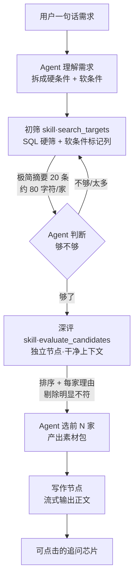

# 初筛 skill 与标的推荐 Agent 设计框架（已作废）

> ⚠️ **本文已被 `推荐功能升级设计框架0805.md` 取代，仅作讨论留痕，不要据此施工。**
> 作废的主要是两处：软条件「标记列 + 命中数排序」方案（改为纯 AND 多次调用），
> 以及「缺失不出局」规则（改为缺失即出局）。八种算子的映射关系仍然有效，已并入新文。

> 2026-08-05 初稿。基于当前 `registry/indicators.py` 的实际字段与配对关系梳理。
> 与 `标的指标体系重构底稿0805.md` 联动：schema 的字段清单要等指标体系有结论才能定死，
> 但筛选逻辑、排序键、链路分工三块可以先落纸。

---

## 一、总体链路



**四段分工的核心原则**：谁擅长什么就干什么。

| 阶段 | 由谁执行 | 为什么 |
|---|---|---|
| 需求理解 | LLM | 自然语言 → 结构化条件，模型的强项 |
| 初筛 | **SQL** | 定量比较与枚举匹配，必须精确、可复现、零幻觉 |
| 深评 | LLM | 不可枚举定性诉求的判断与相对排序，模型的强项 |
| 数字回填 | **代码** | 最终正文里的所有数字来自数据库，模型不得改写 |

---

## 二、初筛 skill 设计

### 2.1 契约来源：不手写，从注册表生成

skill 的说明书（JSON Schema）由三处真源**代码生成**，不再手写：

| 来源 | 提供什么 |
|---|---|
| `registry/indicators.py` | 哪些字段可筛（`screening=True`）、算子、标的侧对应列、默认强度 |
| `recommendation_conditions.py` | 各枚举字段的合法取值集合 |
| 行业字典（DB） | 一级/二级行业的当前启用清单，运行时动态注入 `enum` |

这样加一个字段，schema 自动多一项；改一个枚举，schema 自动跟着变。**行业字典进 `enum` 尤其关键**——模型将无法填出字典外的行业名，从根上消灭「行业写错导致整库被清空」。

当前 `screening=True` 的字段共 **26 个**，覆盖 8 种算子。

### 2.2 八种算子的 SQL 模板

每种算子一个模板，这是整个 skill 的执行代码主体。**全部带 `is null or`，实现"明确不达标出局、数据缺失不出局"**。

| 算子 | 字段数 | SQL 模板 |
|---|---:|---|
| `gte` | 7 | `(t.<col> is null or t.<col> >= :v)` |
| `lte` | 6 | `(t.<col> is null or t.<col> <= :v)` |
| `in` | 3 | `(t.<col> is null or t.<col> = any(:vals))` |
| `eq` | 1 | `(t.<col> is null or t.<col> = :v)` |
| `overlap` | 2 | `exists(select 1 from jsonb_array_elements(t.industry_pairs_json) p where p->>'l1' = any(:vals))` |
| `not_overlap` | 1 | `not exists(select 1 from jsonb_array_elements(t.industry_pairs_json) p where p->>'l1' = any(:vals) or p->>'l2' = any(:vals))` |
| `region_any` | 1 | `(t.location_province = any(:provs) or t.location_city = any(:cities) or t.location_district = any(:districts))` |
| `requirement_capability` | 5 | `(t.<col> is null or t.<col> <> 'no')` |

**两个派生指标需要现算**，除零必须显式处理：

```sql
-- min_net_margin：净利率下限
(t.current_revenue_yuan is null or t.current_revenue_yuan = 0
 or t.current_net_profit_yuan is null
 or t.current_net_profit_yuan / t.current_revenue_yuan >= :v)

-- max_ps：PS 上限（口径问题见问题清单 P1-4）
(t.current_revenue_yuan is null or t.current_revenue_yuan = 0
 or coalesce(t.market_cap_yuan, t.valuation_yuan) is null
 or coalesce(t.market_cap_yuan, t.valuation_yuan) / t.current_revenue_yuan <= :v)
```

### 2.3 软条件不进 where，变成标记列

```sql
select t.id, t.target_name, ...,
       (t.location_city = '杭州')        as pref_region,
       (t.market_cap_yuan >= 1000000000) as pref_market_cap,
       (t.listed_status = 'listed')      as pref_listed
from seller_target t
where <硬条件们>
```

SQL 的三值逻辑白送三态语义：`true` 满足 / `false` 确定不满足 / `null` 数据缺失。
`pref_hit_count` = 标记列中 true 的个数。

### 2.4 排序键（全部客观可数，无权重、无假设）

```
① 软条件命中数 desc     0–N，可数
② 标的优先级 A-E asc     人工标注，可核验（字段待新增）
③ 信息完整度 desc        本轮涉及字段的非空比例，可数
④ 最近更新时间 desc      可数
```

软条件命中数必须在优先级之前——否则用户说的「最好是杭州」会被平台内部排序完全淹没（详见问题清单 P0-1 的失效案例）。

优先级字段上线前，过渡排序为 `① → ③ → ④`。

### 2.5 返回结构

```json
{
  "conditions": {
    "hard": {"行业": ["机械设备","人工智能"], "盈利状态": "盈利"},
    "soft": {"地区": "杭州", "市值": "≥10亿", "上市状态": "已上市"}
  },
  "matched": 89,
  "soft_hit_distribution": {"3": 4, "2": 11, "1": 37, "0": 37},
  "by_soft_condition": {"地区": 12, "市值": 23, "上市": 19},
  "unknown_on": {"市值": 31, "盈利状态": 8},
  "excluded_by_hard": {"行业不符": 402, "明确亏损": 27},
  "returned": [ /* ≤20 条极简摘要 */ ]
}
```

`soft_hit_distribution` 是这个设计的价值核心：agent 一眼看到「全中的只有 4 家、中 2 项的 11 家」，立刻知道该推哪批、要不要放宽。跑两次 SQL 只能得到两个总数，得不到交叉分布。

**单条摘要保持极简**（id、名称、软条件命中、四五个关键字段，约 80 字符）。agent 不负责评估，只负责判断"够不够、要不要再筛"——完整信息在深评那一次调用里出现，不进 agent 的对话历史。

### 2.6 预算与调用策略

| 项 | 值 | 说明 |
|---|---:|---|
| 单次返回上限 | 20 条 | 硬限制，不做字符截断 |
| 单轮调用次数 | 6 次 | 超出后工具返回"预算耗尽，请基于已有结果收尾" |
| 累计候选上限 | 40 家 | 深评的输入规模上限 |
| 去重 | **工具层维护** | 累计已返回 id 集合，后续调用自动排除 |
| 翻页 | `offset` 参数 | 同条件取第 21–40 名，比逼 agent 编新条件干净 |
| 视角收窄 | `min_soft_hits` 参数 | "只要至少中 2 项的"，把名额全给高契合度候选 |

---

## 三、Agent 设计

### 3.1 职责边界

**Agent 负责**：理解需求、决定条件与软硬、决定筛几次、判断够不够、选最终推荐名单、写素材包。

**Agent 不负责**：接触全库（拿不到）、判断定性契合（深评做）、写正文（写作节点做）、决定最终数字（代码回填）。

### 3.2 工具集

| 工具 | 作用 | 预算 |
|---|---|---|
| `search_targets` | SQL 初筛 + 软条件标记 | 6 次/轮 |
| `evaluate_candidates` | 深评：排序 + 理由 + 剔除 | 1 次/轮 |
| `get_target_detail` | 取最终推荐几家的完整画像 | 累计 8 家 |
| `ask_user` | 澄清，调用后本轮结束 | 1 次/轮 |

### 3.3 代码层硬约束（不是提示词劝告）

提示词只能约束策略，取值范围和调用合法性必须由代码与 schema 保证。

1. **只能放宽，不能新增**——agent 不得引入用户没提过的条件（见问题清单 P0-2，实现方式待定）
2. **给结论前必须有真实筛选**——没做过 `count_only=false` 的调用就收尾，工具层拒绝
3. **只能推荐工具返回过的 id**——编造的 id 直接丢弃
4. **数字不由模型给**——`facts` 从数据库回填，模型写的数字不采用
5. **枚举取值由 schema 的 `enum` 约束**——包括运行时注入的行业字典

### 3.4 每次筛选必须可解释

`search_targets` 的每次调用都要声明**哪些当硬条件、哪些当软条件、为什么**，展示给用户。用户看到「我把杭州理解成了倾向而非硬要求」，才有机会纠正。

---

## 四、深评节点设计

**独立节点，不是 agent 自己做。** 四个理由：agent 上下文不随候选数量膨胀；深评拿到没有工具调用历史与系统提示词污染的干净上下文；编排与评估可配不同模型；反向的"为标的找买家"可直接复用。

| 项 | 设计 |
|---|---|
| 输入 | 用户需求**原话** + agent 解析的**结构化条件** + 候选标的的**匹配相关信息** |
| 输出 | 排序（不分档）+ 每家一句理由 + risks + info_gaps + 剔除标记 |
| 信息分级 | 深评用精选信息（约 800 字符/家），排除 PE 口径、财务期间标签、估值时间等对匹配判断无贡献的字段 |
| 分片 | 20 家一片、并发，各自排序后做一次轻量合并（只传名称 + 一句理由） |
| 分片理由 | **不是**为了合并结果，是为了对抗长输入的中间遗忘 |
| 删除权保底 | 全部剔除时保底返回前 3 家并标注"均与需求有明显差距" |

**为什么排序而不分档**：排序是相对判断（两两比较），分档是绝对判断（需要维持一把看不见的标尺）。LLM 对前者稳定得多。同时排序取消后，跨片归一化的需求消失，分片机制可以简化。

**为什么原话和结构化条件都要给**：原话保证不丢失细节（尤其"具备地区产业优势""有成熟海外仓"这类不可枚举诉求）；结构化条件让深评知道硬门槛已经过了，不必重复判断，把注意力全放在定性维度上。

---

## 五、问题清单

### P0-1 排序键次序：软条件命中数必须压过 A-E 优先级

若排序只按 A-E，软条件会完全失效。实例：需求「机器行业，最好是杭州的」，库里机器行业 89 家、其中杭州 12 家。若 A 级有 25 家且杭州那 12 家都是 B/C 级，**前 20 名全是 A 级非杭州标的，12 家杭州标的一家进不了深评**。深评看不到即等于不存在，最终推荐里一家杭州的都没有——而且不报任何错。

第 20 名这条线是全链路唯一不可见、不可申诉的淘汰，排序键必须先反映用户说过的话，再反映平台内部排序。

**状态：已提出建议（命中数 → A-E），待确认。**

### P0-2 Agent 既是解析者又是执行者，没有独立基线防止它编条件

上一轮事故的根因：用户说「杭州标的」，agent 自己编出「半导体 + 华东 + 净利 3000 万」去筛。**全程只有一个模型**——它解析需求，它也执行筛选，没有任何第三方能判定"这个条件用户没说过"。

「只能放宽不能新增」这条规则要落地，必须先有基线。三种做法：

| 方案 | 做法 | 代价 |
|---|---|---|
| A. 拆两步 | 先输出结构化条件作为基线并存档，再据此筛选 | 多一次 LLM 调用 |
| B. 条件带证据 | 每个条件必须附「来自用户原话的哪一段」，工具层做子串校验 | 轻量、可自动校验；但 agent 可以引用无关片段 |
| C. 可见可编辑面板 | 解析出的条件显示在界面上，用户可改 | 最可靠，前端工作量大 |

**倾向 B 先做、C 后补。待讨论。**

### P0-3 "软硬"不是一个能统一施加的属性——26 个字段实际分三类

这是梳理过程中发现的结构性问题，直接影响 schema 形态。

| 类别 | 字段 | 说明 |
|---|---|---|
| **强度编码在值里** | `requires_control` `requires_consolidation` `requires_relocation` `requires_return_investment` `requires_team_retention`（5 个） | 取值本身就是 required/preferred/not_required，外层再套 hard/soft 会有两个来源打架 |
| **自带完整三态** | `region_constraints_json`（1 个） | 内部可同时含 required（必须浙江）/ preferred（最好杭州）/ excluded（排除嘉兴），外层软硬无意义 |
| **天然只能硬** | `excluded_industries_json`（1 个） | 排除就是排除，软化没有语义 |
| **需外部指定软硬** | 其余 19 个定量与枚举条件 | 这些才是 hard/soft 参数的作用对象 |

schema 不能给所有条件都挂一个 `mode: hard|soft`。**待讨论最终形态。**

### P1-4 PS 口径对非上市标的是错的

`max_ps` 的 target_column 声明为 `market_cap_yuan/current_revenue_yuan`。非上市标的没有市值，只有估值——按字面实现会让所有非上市标的在 PS 条件上恒为 null（缺失放行），条件形同虚设。

上面 SQL 模板里我用了 `coalesce(market_cap_yuan, valuation_yuan)` 兜底，但**这是我擅自加的口径**，需要确认：PS 用估值算，在业务上成立吗？

（同类问题：`min_valuation_yuan`/`max_valuation_yuan` 只看 `valuation_yuan`，上市标的的市值不参与——现有打分代码里是做了市值/估值互相兜底的，两处口径不一致。）

### P1-5 行业未归类的标的要不要例外

按"缺失不出局"，`industry_pairs_json` 为空的标的会通过所有行业条件。标的库里未归类行业的通常不少，全放进来会淹没结果。

建议行业这一项例外——缺失也出局，但单独计数告诉 agent「另有 N 家因未归类行业被排除」。**待确认。**

### P1-6 对话式需求表达不了"多方案"

买家需求单支持多方案（方案内 AND、方案间 OR）。对话式输入目前走隐式单方案，表达得了「机械行业**或** AI 行业」（同一条件多值），表达不了「净利 1000 万以上的机械，**或者**净利 3000 万以上的 AI」（两组条件的 OR）。

后者在实务中不罕见。**要不要这轮支持？待讨论。**

### P1-7 多轮之间条件累积还是覆盖

用户先说「杭州」，再说「净利 1000 万以上」——是杭州 ∩ 净利，还是只剩净利？

倾向**累积**，但必须在每轮回答里明说当前生效的完整条件，否则用户三轮之后完全不知道系统在按什么筛。**待确认。**

### P1-8 权限边界：search_targets 目前查全库

现在直接按 `DEFAULT_TEAM_ID / DEFAULT_WORKSPACE_ID` 查询，**没有 owner 过滤**。多人使用时，A 客户经理能通过对话看到 B 负责的标的。这是既有的遗留问题（权限模型改造此前被推迟），但初筛 skill 会把它放大——以前要点进列表页才看得到，现在一句话就能捞出来。

**需要决定是否在这轮补上 owner_scope 过滤。**

### P2-9 上市状态双轨

`preferred_listed_status`（`screening=False`，兼容字段）与 `acceptable_listed_status_json`（`screening=True`）并存。skill 只认后者，前者应确认能否退役。

### P2-10 标的库规模未知，索引策略待定

若库规模在千级以内，全表扫描无压力。若上万，`jsonb_array_elements` 展开的行业匹配需要 GIN 索引，`location_*`、财务字段需要 B-tree。**需要先确认当前与预期规模。**

### P2-11 A-E 优先级字段尚不存在

排序键 ② 依赖的字段还没建。过渡期排序为 `命中数 → 完整度 → 更新时间`。字段上线时需同步：标的信息页录入、解析流程、缺失默认值（建议给 C 而非排最后，否则新标的永远出不来）、以及防优先级通胀的约束（强制分布或客观定义）。

---

## 六、与指标体系重构的联动点

以下三项一旦在 `标的指标体系重构底稿0805.md` 那边有结论，本文的 schema 需同步：

1. **上市交易所**枚举确定后 → 替换现有 `listing_market_region` 的境内/境外二值
2. **主要产品 / 产业链方向**归类确定后 → 决定它进 SQL（受控标签）还是进深评（自由文本）
3. **毛利率**标的侧补列后 → `min_gross_margin` 才能从"永远缺失放行"变成真实条件
