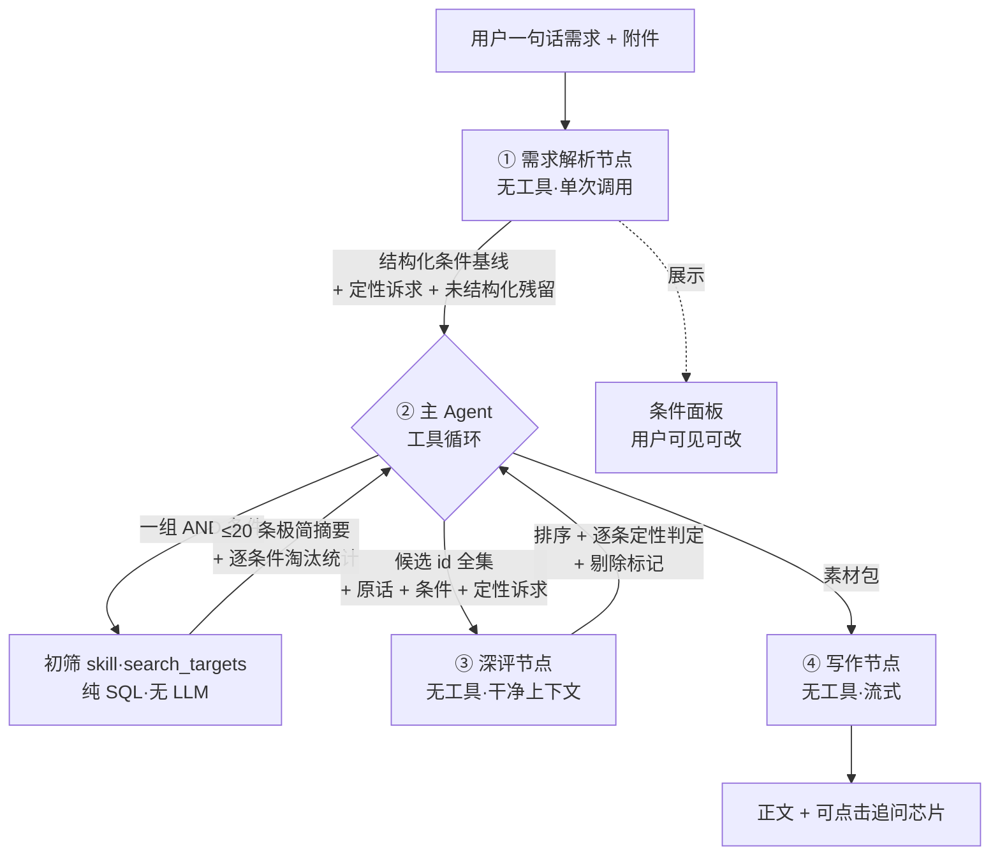

# 推荐功能升级设计框架

> 2026-08-05。**本文取代 `初筛skill与推荐agent设计框架0805.md`**（那份的标记列方案已废弃）。
> 与 `标的指标体系重构底稿0805.md` 联动：schema 的字段清单待那边有结论后收口。

---

## 一、这次要解决什么

现有对话式推荐的链路是「一个 agent 包办一切」：它解析需求、调用一个既不筛选也不可解释的工具、
自己判断、自己写结论。三个根本问题：

1. **`search_targets` 不是筛选器。** 它全表扫描后逐个打分，只有明确冲突才出局——返回的
   「命中 N 家」几乎恒等于全库数量，agent 拿不到任何可用于调整策略的信号。
2. **解析与执行在同一个模型里。** 没有任何地方能比对「用户说了什么」和「agent 筛了什么」，
   编造条件无法被发现。
3. **可筛字段只开放了 12 个**（引擎实际支持 26 个），且 schema 手写、与注册表脱钩，行业名
   写错会静默清空整个候选池。

升级后的目标形态：**四个各司其职的节点 + 一个纯 SQL 的初筛 skill**，
让 LLM 只做它擅长的（理解语言、判断定性、组织表达），把比较与匹配全部交给 SQL，
把最终数字全部交给代码。

---

## 二、总体链路



### 分工原则

| 阶段 | 执行者 | 理由 |
|---|---|---|
| 需求理解 | LLM | 自然语言 → 结构化，模型强项 |
| 初筛 | **SQL** | 比较与匹配必须精确、可复现、零幻觉 |
| 定性判断与排序 | LLM | 不可枚举诉求的判定，模型强项 |
| 数字回填 | **代码** | 正文数字一律来自数据库 |
| 调用策略 | LLM（主 Agent） | 筛几次、带哪些条件、何时收尾 |

### 关键约定（本轮讨论确定）

- **skill 只做 AND，永不做 OR。** 多方案由主 Agent 拆成多次调用实现。
- **skill 不认软硬。** 每次调用都是一组纯硬条件；"倾向于"通过"这次调用带不带它"表达。
- **缺失即出局。** 条件字段为空的标的不进候选——这是 agent「减条件放宽」策略成立的前提。
- **排序只在同一条件集内部发生**，不存在满足 1 个条件和满足 2 个条件的标的交叉比较。

---

## 三、① 需求解析节点

**可复用的现成资产**：`recommendation_query_parser` 节点（[recommendation_conditions.py:236](../backend/app/services/recommendation_conditions.py:236)
的 `parse_recommendation_message`），改造后被孤立至今无人调用。

它现在做的事：注入 `mode` / 当前条件 / 行业字典 / 用户消息 → 调 LLM → `normalize_parse_result`
按 `OVERRIDE_FIELD_KINDS` 白名单过滤（字段不在表里直接丢、值过不了类型校验直接丢）→
失败时 `fallback_parse_result` 把整句话记成语义偏好，不丢信息。

**但它的输出形态是「增量操作」而不是「完整快照」**：产出的是 `condition_ops`
（`set` / `remove` / `exclude` 三种），设计目的是在列表页上「对已有条件打补丁」。
新链路需要的是一份完整的需求快照（`condition_groups`）。

所以诚实的评估是：**骨架能省（节点配置读取、白名单校验、类型强制、降级兜底、行业字典注入），
输出 schema 要重写。** 不是拿来即用，但也远不是从零开始。

### 为什么必须独立出来

拆开之后，**结构化条件成为可展示、可编辑、可审计的基线**，主 Agent 只能消费不能创造。
「agent 编造条件」这个问题从结构上消失，不需要额外的证据校验机制。

代价是多一次 LLM 调用（约 3–8 秒）。

### 输出 schema（≠ 筛选 schema）

解析输出比筛选参数多三类东西，缺一不可：

```json
{
  "condition_groups": [
    {
      "label": "上市公司",
      "conditions": {"industries_json": ["机器人","人工智能"],
                     "acceptable_listed_status_json": ["listed"],
                     "min_market_cap_yuan": 100000000, "max_pe": 15},
      "strength": {"min_market_cap_yuan": "required", "max_pe": "preferred"}
    },
    {
      "label": "非上市公司",
      "conditions": {"industries_json": ["机器人","人工智能"],
                     "acceptable_listed_status_json": ["unlisted"],
                     "min_revenue_yuan": 30000000},
      "strength": {"min_revenue_yuan": "required"}
    }
  ],
  "qualitative_requirements": ["具备地区产业优势", "有成熟的海外仓网络"],
  "exclusions": {"industries": ["房地产"]},
  "unstructured_notes": ["希望能配合做业绩承诺"],
  "raw_text": "用户原话"
}
```

四个设计要点：

- **`condition_groups` 是多方案的对话式表达**，不落 `buyer_intent_scenario` 表——
  对话链路不需要持久化多方案（详见第七节 Q1）。
- **`conditions` 里的字段严格限定在初筛 skill 支持的集合内**，但**采用双出口**：
  能映射到可筛字段的进 `conditions`，映射不了的落进 `qualitative_requirements`
  或 `unstructured_notes`——**白名单只约束前者，不约束后者**，这样没有任何用户表达会凭空消失。
  （反面教材：用户说「要经营稳定的」，若 `operation_stability_status` 不在白名单又没有兜底出口，
  这句话就既不进条件也不进定性诉求，静默蒸发。）
- **提示词里要注入可筛字段清单，代码里要做白名单校验——两者都要，作用不同**：
  前者提高召回（模型知道有哪些槽位可填），后者保证正确（模型填不出不存在的字段）。
  字段清单必须**从注册表生成后注入为 prompt 变量**（形态类比现有的 `industry_l1_list`），
  与 schema 生成器共用同一个真源，否则两边必然漂移。
- **`strength` 只给主 Agent 看**，skill 不认。它决定 agent 先带哪些条件、放宽时先去掉哪些。
- **`qualitative_requirements` 是深评的输入**，筛选完全用不上，但必须在解析阶段就抓出来，
  否则后面没人再看用户原话。
- **`unstructured_notes` 记录"用户说了但我没能结构化的话"**——它让"漏掉了什么"变得可见，
  是这份 schema 里最容易被忽略也最该保留的一项。

---

## 四、初筛 skill（search_targets）

### 4.1 schema 从注册表生成，不手写

| 真源 | 提供 |
|---|---|
| `registry/indicators.py` | 可筛字段、算子、标的侧对应列 |
| `recommendation_conditions.py` | 枚举字段的合法取值 |
| 行业字典（DB） | 一级/二级行业当前启用清单，运行时注入 `enum` |

行业字典进 `enum` 是关键：模型将**无法**填出字典外的行业名，从根上消灭「行业写错清空整库」。

### 4.2 算子与 SQL 模板

八种算子覆盖全部可筛字段。**缺失即出局，因此模板不带 `is null or`**——
SQL 三值逻辑天然满足（`null >= 5` 不为 true，行被过滤）。

| 算子 | SQL |
|---|---|
| `gte` | `t.<col> >= :v` |
| `lte` | `t.<col> <= :v` |
| `in` | `t.<col> = any(:vals)` |
| `eq` | `t.<col> = :v` |
| `overlap` | `exists(select 1 from jsonb_array_elements(t.industry_pairs_json) p where p->>'l1' = any(:vals))` |
| `not_overlap` | `not exists(... where p->>'l1' = any(:vals) or p->>'l2' = any(:vals))` |
| `region_any` | `t.location_province = any(:p) or t.location_city = any(:c) or t.location_district = any(:d)` |
| `requirement_capability` | `t.<col> <> 'no'` |

**两处特殊约定**：

- **排除条件是粘性的**：`not_overlap` 每次调用都必须带上，不参与放宽。用户说不要的东西，
  放宽多少次都还是不要。
- **`requires_*` 五个字段简化为布尔**：既然 required 和 preferred 生成同样的 SQL，
  schema 里只留「要求控股 = 是」，强度由调用策略表达。

### 4.3 返回结构

```json
{
  "conditions": {"industries_json": ["机器人","人工智能"], "max_ps": 8, "min_revenue_yuan": 30000000},
  "matched": 3,
  "excluded_by_condition": {
    "max_ps":           {"总计": 86, "字段为空": 84, "确实超标": 2},
    "min_revenue_yuan": {"总计": 12, "字段为空": 1,  "确实不足": 11}
  },
  "returned": [ /* ≤20 条极简摘要，约 80 字符/家 */ ]
}
```

**`excluded_by_condition` 的拆分是这个设计的核心。** 它是 agent 能否正确放宽的唯一依据：
上例中 PS 那条该去掉（86 家里 84 家只是没录数据），营收那条该保留（12 家里 11 家真不够）。
没有这个拆分，agent 只能看到「加了 PS 从 89 掉到 3」，无法区分「条件太严」与「数据没录」，
放宽方向必然靠猜。

**摘要保持极简**：id、名称、四五个关键字段。主 Agent 不评估，只判断"够不够、要不要再筛"；
完整信息只在深评那一次调用里出现，不进 agent 的对话历史。

### 4.4 排序与预算

**准入闸门（已实现）**：`st.target_grade <> 'E'`。E 级与 `lifecycle_status` 的已售出/已停售
严格双向绑定，由 `services/entity_grade.py` 单点派生。这一条永远生效，不由买家指定。

排序键（全部客观可数）：

```
① 标的级别 A-D asc        已上线的 target_grade
② 最近更新时间 desc        信息越新，报出去的数字越不容易翻车
```

「信息完整度」不再作为排序键——缺失即出局之后，活下来的标的在本轮所有条件字段上都有值。

**排序发生在取前 20 之前**：先按 A-D 排完整个命中集，再截前 20——不是先截再排。

现有 [recommendation_flow.py:1254](../backend/app/services/recommendation_flow.py:1254) 的注释
「A-D 之间不影响召回与排序」描述的是**正式推荐链路**：那条路有匹配分数，级别不该干扰分数。
初筛 skill 是另一条路——硬筛之后所有幸存者在条件上等价，没有分数可排，A-D 就是排序键。
两条路规则不同是设计使然，落地时需在 skill 代码里写清楚。

| 项 | 值 |
|---|---:|
| 单次返回上限 | 20 条（硬限制，不做字符截断） |
| 单轮调用次数 | 6 次 |
| 累计候选上限 | 40 家 |
| 去重 | **只在汇总给深评时做，不在查询时做**（见下） |
| 翻页 | `offset` 参数（同一条件下要更多） |
| 试探 | `count_only` → 真正的 `count(*)`，成本可忽略 |

**去重必须发生在汇总环节，绝不能发生在查询环节。**

反例：机器行业 89 家，A 级的 20 家里有 3 家在杭州。第一次调用「机器」返回这 20 家；
第二次调用「机器 + 杭州」时若把已返回的 id 排除掉，**那 3 家最好的杭州标的就不出现了**，
返回的是杭州的 B、C 级——用户会看到「杭州最好的是 B 级」，而这是假的。

正确做法：每次查询独立执行、如实返回该条件下的真实前 20；工具层在把候选交给深评前才按 id 合并。
**重复出现本身是有价值的信号**——同时满足多组条件的标的是强候选，合并时应记录它命中了几组，
一并传给深评。

### 4.5 关于数据覆盖率（已否决的方案）

曾考虑在 schema 字段描述里附上各字段的非空覆盖率，让 agent 提前避开低覆盖率条件。
**否决**：当前库是测试数据，字段不全是常态，据此算出的覆盖率会把 agent 带偏；
而 `excluded_by_condition` 已经给出针对本次查询的实时、准确拆分——事后准确版存在时，
事前预告版不值得引入一个会说谎的数字。

---

## 五、③ 深评节点

**独立节点，不是主 Agent 自己做。** 四个理由：agent 上下文不随候选数量膨胀；
深评拿到没有工具历史与系统提示词污染的干净上下文；编排与评估可配不同模型；
反向的「为标的找买家」可直接复用。

### 输入

| 内容 | 来源 | 为什么要 |
|---|---|---|
| 用户原话 | 解析节点 | 不丢失细节 |
| 结构化条件 | 解析节点 | 告知硬门槛已过，不必重复判断 |
| 定性诉求清单 | 解析节点 | 这是深评的**主要工作对象** |
| 候选标的画像 | skill + 画像栏目 | 约 800 字符/家，排除对匹配判断无贡献的字段 |

排除的字段：PE 口径、财务期间标签、估值/报价时间等——它们对"合不合适"没有贡献，纯占位。

### 输出 schema

```json
{
  "ranked": [
    {
      "id": "...", "rank": 1,
      "qualitative_verdicts": {
        "具备地区产业优势": "符合",
        "有成熟的海外仓网络": "无法判断"
      },
      "fit_points": ["...", "..."],
      "risks": "...", "info_gaps": "..."
    }
  ],
  "dropped": [{"id": "...", "reason": "..."}]
}
```

**`qualitative_verdicts` 逐条判定是排序的依据，不是装饰。** 它让 LLM 做它擅长的离散判定
（符合 / 不符合 / 无法判断），排序成为判定的结果而非凭空的偏好——同时天然可解释：
用户问"为什么这家排第一"，答案就是三条定性诉求全部符合。

### 其他约定

- **排序不分档。** 排序是相对判断（两两比较），分档是绝对判断（需维持一把看不见的标尺），
  LLM 对前者稳定得多。取消分档后跨片归一化的需求消失。
- **分片仍保留**，但理由变了：20 家一片、并发，是为了对抗长输入的中间遗忘，不是为了合并。
- **删除权设保底**：全部剔除时保底返回前 3 家并标注"均与需求有明显差距"。
  「一家都没有」比「有几家但都不理想」糟糕得多——后者至少给了客户经理判断材料。

---

## 六、② 主 Agent 与 ④ 写作节点

### 主 Agent 的职责与边界

**负责**：读基线条件 → 制定调用策略 → 判断够不够 → 调深评 → 选最终名单 → 产出素材包。

**不负责**：产生条件（解析节点的事）、接触全库（拿不到）、判断定性契合（深评的事）、
写正文（写作节点的事）、决定数字（代码回填）。

### 代码层硬约束（不是提示词劝告）

1. 只能推荐工具返回过的 id，编造的直接丢弃
2. 给结论前必须有过真实筛选（只做 `count_only` 就收尾 → 工具层拒绝）
3. 条件只能来自解析基线，不得新增基线里没有的字段
4. 数字由 `facts` 从数据库回填，模型写的数字不采用
5. 枚举取值由 schema 的 `enum` 约束（含运行时注入的行业字典）

### 调用策略（提示词负责）

- 先按完整条件搜；召回不足时，依据 `excluded_by_condition` 判断该去掉哪一条
- 优先去掉「字段为空占多数」的条件（数据没录），保留「确实不达标占多数」的条件（真门槛）
- 排除条件永不去掉
- 每次调用都声明本次带了哪些条件、为什么——展示给用户

### 写作节点

维持现状：无工具、单次调用、API 侧流式输出。改动两处——
删掉"把追问揉进文末一句话"的规则（改由芯片承载），以及素材包结构随深评输出调整。

---

## 七、数据模型与字段设计的四个问题

### Q1　多方案能不能简化成「上市 / 非上市」两个固定方案？

**不能，但对话链路根本不需要多方案字段。**

上市/非上市只是常见分档之一。反例：`recommendation_conditions.py:344` 的代码注释里就记着一个实测案例——
「市值≥10亿 → 盈利≥1000万；市值<10亿 → 盈利≥1亿」，这是**市值分档**，固定两方案装不下。
同理还有行业分档（"机械净利1000万，AI净利3000万"）。

但关键在于：**对话式推荐里，多方案不需要存储机制**——主 Agent 拆成多次 skill 调用就完成了。
`buyer_intent_scenario` 表只对**持久化的需求单**有意义（列表页展示、反向匹配要用）。

结论：

- 对话链路：用解析节点输出的 `condition_groups`，不落库、不碰 scenario 机制
- 需求单：保留现有通用 scenario，**不要**简化成固定两档
- 未来可能的收敛：如果对话链路的「条件组 + 多次筛选」被验证有效，需求单侧的
  `condition_effects_json` + `_select_with_scenario_quota` 那一整套或可用同样方式替代。
  **不在本轮**。

### Q2　skill 的 schema 要不要覆盖标的的全部定量 + 可枚举定性指标？

**不按"是不是定量/可枚举"决定，按三条准入规则决定。**

标的侧现有 13 个定量 + 14 个枚举（注册表口径）。全覆盖不可取——schema 越大，
模型选错字段的概率越高，而有些字段作为筛选条件毫无业务意义。

准入三条：

1. **成对**：买家侧有对应的诉求表达
2. **可决策**：该条件能独立影响"买不买"
3. **有数据**：标的侧覆盖率不能太低（缺失即出局之后，低覆盖率字段一提就把召回打空）

按此筛出的建议范围：

- **纳入的定量**（约 11 个）：营收、净利、利润总额、总资产、负债率、市值、估值、报价、PE、溢价率、出售比例
- **排除的定量**：经营现金流额（极少作条件）、毛利率/净利率（标的侧无列，见指标底稿）、
  财务期间截止日、估值/报价时间（当前是 text，且属新鲜度而非匹配维度）
- **纳入的枚举**（约 18 个）：行业 L1/L2、排除行业、地区、上市状态、上市地、盈利状态、
  现金流状态、可控股、可并表、接受少数股权、接受迁址、接受返投、团队可留任、是否还卖、标的类型，
  以及**建议补进注册表**的经营稳定性、转让灵活度、对赌依赖
- **排除的枚举**：PE 口径（元数据）、信息状态 / 生命周期 / 推荐状态 / 调研结果（系统内部）

即约 **29 个**，比现在的 26 个略多，但组成不同。

### Q3　买家需求解析要不要独立 schema？包含哪些字段？

**要，而且不能等于筛选 schema。** 完整定义见第三节。

核心区别：筛选 schema 是「一次调用的 AND 参数」，解析 schema 是「用户完整需求的结构化表示」。
后者多出三类筛选用不上、但下游必需的东西——**条件强度**（决定 agent 的调用策略）、
**定性诉求**（深评的工作对象）、**未结构化残留**（让遗漏可见）。

### Q4　深评的字段要不要进 schema？怎么处理和输出？

要分清两个 schema：

- **输入 schema**：不是"买家能提的条件"，而是"标的的完整画像"——需求侧与供给侧不是一回事。
  约 800 字符/家，排除对匹配判断无贡献的字段。
- **输出 schema**：见第五节。关键是 `qualitative_verdicts` 对每条定性诉求逐条给判定，
  排序作为判定的结果产出。

---

## 七点五、初筛到底能提供多少可用条件

> **本节于 2026-08-17 按 `25ede18` 的注册表实况重写。** 初版写于指标体系重构之前，
> 结论已大幅过时——`major_risk_flags_json`、`acceptable_transaction_structures_json`、
> 交易所闭集、`main_products_text` 等当时被判为"缺口"的字段均已落地。

以客户经理在用的《买家需求分类表》11 项为基准逐项对照，再补上并购实务中真正会一票否决、
而表单没写全的条件。**判断标准只有一条：不满足就不必再看的，才配进初筛；其余进深评。**

### 7.5.1 表单 11 项逐项对照

| # | 表单条目 | 标的侧字段 | 买家侧条件 | 结论 |
|---:|---|---|---|---|
| 1 | 所属行业 | `industry_pairs_json` ✅ | `industries_json` / `industry_l2_json` ✅ | ✅ 可用 |
| 2 | 市值（上市）/ 估值（非上市） | `market_cap_yuan` / `valuation_yuan` ✅ | `min/max_market_cap_yuan`、`min/max_valuation_yuan` ✅ | ✅ 可用 |
| 3 | 可接受溢价范围 | `premium_rate` ✅ | `max_premium_rate` ⚠️ **缺算子与对手方声明** | 🟡 补声明 |
| 4 | 经营情况（净利润） | `current_net_profit_yuan` ✅ | `min_net_profit_yuan` ✅ | ✅ 可用 |
| 5 | 可接受负债率范围 | `current_debt_ratio` ✅ | `max_debt_ratio` ✅ | ✅ 可用 |
| 6 | **能否接受重大风险** | `major_risk_flags_json` ✅ **闭集已就绪**<br/>（涉诉/股权冻结/被执行/违规违法/已核查无重大风险） | ⚠️ 只有自由文本 `major_risk_tolerance_summary`，**缺枚举型对手方** | 🟡 需新增买家侧字段 |
| 7 | 交易方式（多选） | `acceptable_transaction_structures_json` ✅ **闭集已就绪**<br/>（股权转让/增资/资产收购/合并/其他） | `transaction_types_json` ⚠️ **缺算子与对手方声明** | 🟡 补声明 |
| 8 | 收购方所在地区产业优势 | — | `buyer_industry_advantage_summary` ✅ | ⛔ 深评（买方自身属性） |
| 9 | 地域区位 | `location_province/city/district` ✅ | `region_constraints_json` ✅ | ✅ 可用 |
| 10 | 收购股权比例 | `transfer_ratio_min/max` ✅ | `desired_equity_ratio_min/max` ✅ | ✅ 可用 |
| 11 | 其他要求 | — | 自由语义 | ⛔ 深评 |

**11 项里 6 项开箱可用，3 项只差声明或一个买家侧字段，2 项本就该进深评。**
初版把第 6、7 项判为"最大缺口"已不成立——标的侧的闭集都做好了，
**卡点全部落在买家侧**：要么缺一个枚举字段（第 6 项），要么缺 `operator` + `target_column`
两行声明（第 3、7 项）。

**第 2 项验证了一个既有设计**：表单按上市/非上市分成两套，差别正好在"价值轴用市值还是估值"——
这与打分代码里「上市看市值、非上市看估值」的口径一致。两套表单其实是同一套条件的两个分支，
对应 agent 的两次调用，不需要两套字段。

**第 8 项要特别说明**：「收购方所在地区产业优势」描述的是买家自己，用于判断产业协同，
不能拿去筛标的。它属于深评的输入（现有 `buyer_party_fact_block` 已在做类似注入）。

### 7.5.2 买家侧待补的四项——推荐线的硬依赖

标的侧的闭集都已就绪，**卡点全部落在买家侧**。这四项必须由指标线先交付：

| 项 | 标的侧（已就绪） | 买家侧待办 | 成本 |
|---|---|---|---|
| **重大风险** | `major_risk_flags_json`<br/>`litigation / equity_frozen / enforcement / violation / none` | **新增枚举字段**，建议 `acceptable_major_risk_flags_json`，取值与标的侧对齐（语义：能接受哪些）。算子 `not_overlap`——标的命中任一「买家不接受的风险」即出局 | 需迁移 |
| **交易结构** | `acceptable_transaction_structures_json`<br/>`equity_transfer / capital_increase / asset_purchase / merger / other` | `transaction_types_json` 补 `operator='overlap'` + `target_column`，置 `screening=True` | 仅声明 |
| **溢价上限** | `premium_rate` | `max_premium_rate` 补 `operator='lte'` + `target_column='premium_rate'` | 仅声明 |
| **接受少数股权** | `accepts_minority_investment` | 算子与对手方**都已声明**，只差 `screening=True` | 一个标志位 |

重大风险为什么用多选闭集而不是布尔：表单问的是「能否接受重大风险」，但实务里买方的容忍度
往往是分项的——能接受历史诉讼，不能接受股权冻结。存成与标的侧对齐的多选，
既能表达「全都不接受」（选空），也能表达分项容忍，且不需要第二套枚举。

### 7.5.3 仍然无解的三项

以下买家条件**标的侧没有可筛对手方**，本轮进不了初筛：

- `earnout_requirement`（对赌要求）——标的侧 `earnout_dependency_status` 有 DB 列但未进注册表
- `min_gross_margin`（毛利率下限）——标的侧无毛利率列，也无法从现有字段推算
- `industry_focus_tags_json`（字典外细分方向）——标的侧新增了 `main_products_text`，
  但那是自由文本，构不成可筛对手方。这一项适合走深评

另有两项**属于系统级过滤，不是买家条件**，建议一并接进 skill：

- **已在与其他买家深度推进**（`buyer_seller_relation` + `DEEP_PROGRESS_STATUSES`）——
  现在只作提醒标记，建议升级为可选排除条件
- **财务数据新鲜度**（`financial_period_end_date`）——用三年前的净利匹配「净利 1000 万」
  是在制造假匹配，建议作为可选过滤

> **已作废的两条初版建议**：①「是否还在卖」不必单独接——`target_grade='E'` 闸门已覆盖
> （E ⟺ 已售出/已停售），且 `is_for_sale` 与之语义重叠，属待清理项。
> ②「经营稳定性」不要补——`operation_stability_status` 已在 `8e14c78` 被判为伪枚举删除。

### 7.5.4 初筛条件清单汇总（按 `25ede18` 实况）

| 分类 | 数量 | 说明 |
|---|---:|---|
| 注册表 `screening=True`，可直接生成 schema | **26** | 含行业 L1/L2、排除行业、结构化地区、五项财务门槛、PE/PS、估值/市值上下限、负债率、盈利/现金流状态、上市状态、**上市交易所（已换闭集）**、股比上下限、控股/并表/迁址/返投/留任 |
| 建议从中剔除 | −2 | `min_net_margin`（标的侧无净利率列，靠现算）、`max_ps`（非上市无市值，口径本身是坏的） |
| 补声明即可接入 | +3 | 接受少数股权、交易结构、溢价上限 |
| 需新增买家侧字段 | +1 | 重大风险容忍 |
| 系统级过滤（非买家条件） | 3 | E 级闸门（已实现）、已深度推进（可选）、财务新鲜度（可选） |

**初筛可用条件合计 28 项**，其中 24 项零成本、3 项补声明、1 项需迁移。

**明确划给深评的**：收购方产业优势、其他要求、对赌、毛利率、字典外细分方向、主要产品，
以及所有宽泛语义诉求（地区产业配套、海外仓、上下游协同等）。

### 7.5.5 一条设计原则

初筛条件的准入标准不是「这个字段能不能比较」，而是「**不满足就不必再看吗**」。

按这条尺子，表单第 3 项（溢价范围）其实是边界情况——溢价高但标的极好，买方通常愿意谈；
它更像量级参考而非一票否决。放进初筛可以，但应由 agent 判断为「优先条件」，
在召回不足时第一批被去掉。这类判断正是 `strength` 字段存在的意义。

| 阶段 | 内容 | 依赖 |
|---|---|---|
| 一 | 初筛 skill：schema 生成器 + 8 个算子的 SQL 模板 + 返回结构 + 覆盖率统计 | 指标体系收口（可先按现状做，字段清单后置） |
| 二 | 复活解析节点：输出 schema + 基线存储 + 提示词 | 无 |
| 三 | 深评节点改造：排序替代分档 + 定性逐条判定 + 保底规则 | 阶段一（候选结构） |
| 四 | 主 Agent：工具集调整 + 硬约束 + 提示词 v0.2.0 | 一、二、三 |
| 五 | 前端：条件面板（可见可改）+ 追问芯片 | 二、四 |

阶段一与二可并行。每阶段跑测试；涉及后端的推送后按 `AGENTS.md` 的流程验证两套部署。

---

## 八点五、拆施工单前需要补齐的输入

以下五项缺任何一项，施工单都只能写成"待定"，做出来无法验收。

### ① 买家侧四项字段的最终形态（**硬阻塞**，指标线交付）

见 7.5.2。其中重大风险需要迁移，另三项只需注册表声明。
**只要这四项的 `operator` + `target_column` + `enum` 定稿，schema 生成器就能开工**——
录入界面、解析提示词、展示这些可以与推荐线并行，不阻塞。

### ② 验收用例（**最重要，也最容易被跳过**）

当前没有任何一组「标准需求 → 期望结果」，导致"推荐准不准"只能靠感觉判断。
**建议提供 5–8 条真实需求原文 + 人工标注的期望候选**（哪几家该出现、哪几家不该出现、为什么），
覆盖：单条件、多条件、含定性诉求、含分组（上市/非上市）、以及一个"条件过严应触发放宽"的用例。

这套用例同时是四个阶段各自的验收依据：解析节点验条件抽取是否完整、
skill 验召回是否正确、深评验排序是否合理、agent 验放宽策略是否得当。

### ③ 深评节点的模型与延迟预算

40 家 × 约 800 字符 ≈ 3.2 万字符输入。需要确认：用哪个模型（现配千问 plus）、
可接受的单次延迟、`timeout_seconds` 设多少。这直接决定分片大小与并发数。

### ④ 前端条件面板的形态

解析出的结构化条件展示到什么程度——只读展示、可删除、还是可编辑？
工作量差异很大，且影响解析节点是否需要支持"用户改完后重新筛选"的回路。

### ⑤ 旧链路的处置

买家需求单那条打分链路（`_candidate_targets_for_intent`）本轮改不改？
不改的话，同一个平台会存在两套排序规则（一套按匹配分、一套按 A-D），
需要明确这是有意为之，并在两处代码注释里互相指认。

---

## 九、已知取舍与遗留

- **权限边界不做**（本轮确认）。`search_targets` 仍按 team/workspace 查全库，无 owner 过滤；
  多人使用时可跨负责人捞到标的。初筛会放大这个既有问题——以前要点列表页，现在一句话就能捞。
- **A-E 级别字段已上线**（`target_grade`，注册表 `indicators.py:209`）。E 不进筛选这一条
  已在 `_candidate_targets_for_intent` 的 WHERE 里实现，反向的 `intent_grade <> 'E'` 同样已有。
  该字段**故意没设 `screening` / `deterministic_rank`**——它不是买家条件，只服务系统级过滤与排序，
  这与本文的用法一致。仍需关注：防级别通胀（若多数标的被标成 A，排序退化为按更新时间）。
- **`is_for_sale` 与 E 级语义重叠**，属待清理项，不要再接进筛选（见 7.5.3）。
- **标的库规模千级**，全表扫描与 jsonb 展开均无压力，索引可后置。
- **反向「为标的找买家」不在本轮**，但深评节点与 schema 生成器的设计已为其预留。
- **联动指标体系**：上市交易所枚举、主要产品/产业链方向归类、毛利率补列，
  三项一旦定稿需回头同步 schema。
